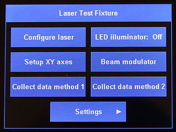

# Teensy User Interface

This library is a simple touchscreen user interface for building Teensy applications.  Adding buttons and menus to your sketch is as-easy-as filling in a table.  The library also includes many functions for displaying your own data.

## Documentation:
Documentation and code for the *Teensy User Interface* library can be found at:

​    https://github.com/Stan-Reifel/TeensyUserInterface

## License:

Copyright (c) 2019 S. Reifel & Co.   -   Licensed under the MIT license.
